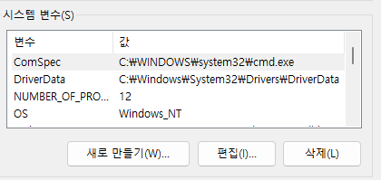

# openAI 의 API를 활용한 React 프로젝트

# openAI 키 설정

- 윈도우 검색창에서 `고급 시스템` 입력 후 `고급 시스템 설정`, `시스템 설정`을 열기
- `환경변수` 클릭
- 시스템 변수에 키 입력
  
- `bash` 터미널에서 `echo $OPENAI_API_KEY`

## openAI API 를 사용하기 위한 dependency 설정

- `npm install openai`

## git reposiroty 문제해결

- `root` 폴더를 local git repository로 등록하지 않은 상태에서 `create-next-app` 또는 `crate-react-app`명령으로 프로젝트를 생성하면, 개별 프로젝트가 local git repository로 생성되어 버림
- 이 상태에서 `root` 폴더에서 `git init`를 실행하고, local git repository로 생성하는 경우 새로 만들어진 프로젝트 폴더가 `github`에 정상적으로 업로드 되지 않는다
- 이럴때 먼저 새로 생성된 프로젝트 폴더에서 터미널을 열고 `rm -rf .git` 명령 실행
- 새로 생성된 프로젝트 이름 변경
- 다시 `root`에서 명령어 실행, 프로젝트 폴더가 업데이트 됨.
